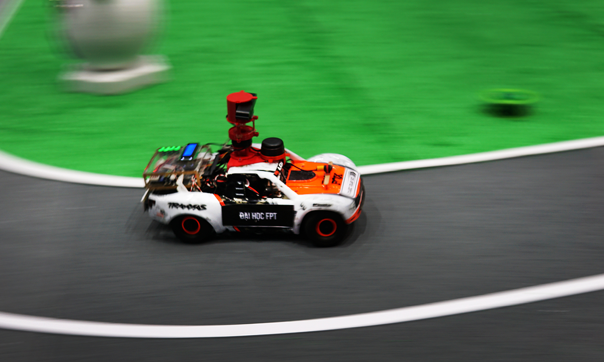
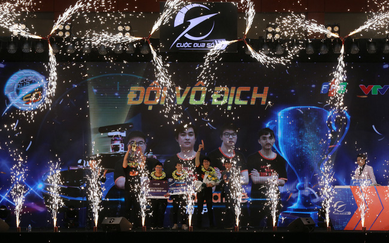
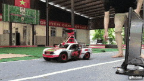
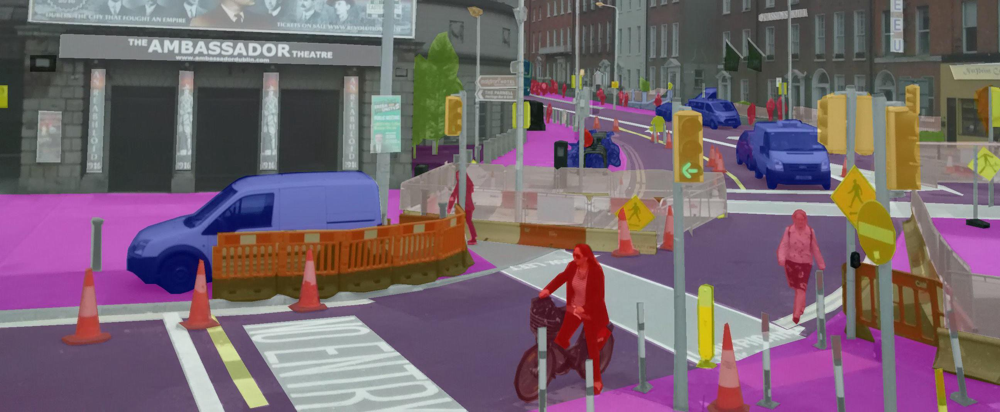
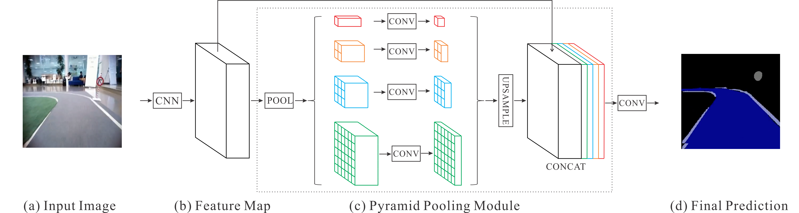
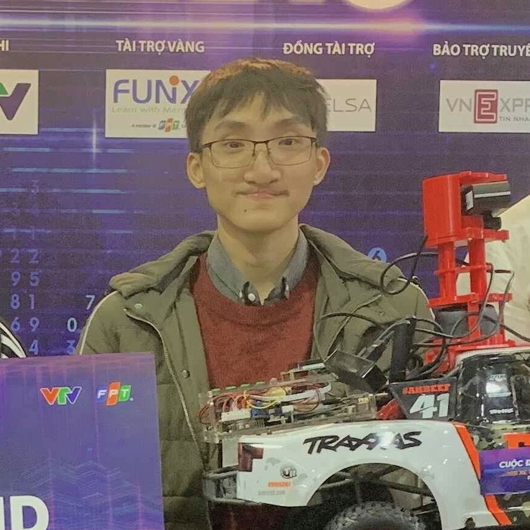

We are the champions of digital race.

### Paper:
Our paper published at ICSCA 2021, you can see details at https://doi.org/10.1145/3457784.3457827.
### Demo:

Welcome! This is an open-source self-driving car aimed for rapid prototyping, deep learning, and robotics research. The system currently runs on a jetson tx2 module. Here are our goals:

### Goals:
Research and develop a deep learning-driven self-driving car. The vehicle should be able to finish the race. 

### Role 
To know the role, please read [documentation](./role/README.md). 

#### The modules in this project.

1. Semantic Segmentation
2. Object Detection

For the full documentation of the development process, please visit my website: [datvuthanh.github.io](https://datvuthanh.github.io)

## Table of Content
- [Introduction](#Introduction)
- [Try it out](#Try-it-out)
- [About ROS](#About-ROS)
- [Semantic Segmentation](#Semantic-Segmentation)

## Introduction
Digital Race is a contest that is sponsored by FPT Corp. The task of the teams completing the race in the shortest time.

## Try it out

To compile the project:

##### Requirements

1. Make sure that you have [ROS](http://wiki.ros.org/melodic/Installation/Ubuntu) installed on your computer. (I am using ROS Melodic)
2. Make sure you have all the [dependencies](./src/README.md) installed. 

##### Clone & Compile

1. Clone the repository. `$ git clone https://github.com/datvuthanh/Digital-Race.git`
2. `$ cd Digital-Race` 
3. `$ cp -r src/. ~/catkin_ws/src/.`
4. `$ cd ~/catkin_ws/`
5. `$ catkin_make`
6. `$ source devel/setup.bash`

## About ROS
This project uses ROS. __For more information on ROS, nodes, topics and others please refer to the ROS [README](./src/README.md).__

## Semantic Segmentation
The cart understands its surrounding  through semantic segmentation, which is a technique in computer that classifies each pixel in an image into different categories. The vehicle can also make decisions based on the segmentic segmentation results. The cart can change its speed based on the proximity to nearby obstacles.

We deployed the PSPNet architecture for segmentation. PSPNet is design to work well in realtime applications. For more information, please visit the [paper](https://arxiv.org/pdf/1612.01105.pdf). We collect dataset for training and the python code for training and inferencing are located in the `segmentation` directory.

[VIDEO DEMO](https://youtu.be/RMJ9s7XbxDs)

# Contact / Info
If you are interested in the detailed development process of this project, you can contact me at email address: stephen.t.vu@hotmail.com or datvthe140592@fpt.edu.vn

**Contributors:**

**Dat Vu (Leader)** | [Email](mailto:stephen.t.vu@hotmail.com) | [Github](https://www.github.com/datvuthanh) | [Website](https://datvuthanh.github.io/)

**Hai Anh Tran** | [Email](mailto:anhthhe141545@fpt.edu.vn) | [Github](https://github.com/AnhTH-FUHN)

**Tra Dinh** | [Email](mailto:trandhe140661@fpt.edu.vn) 

**Huy Phan** | [Email](mailto:HuyPQHE141762@fpt.edu.vn) 

