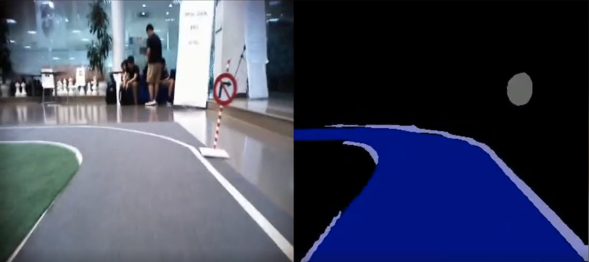

### Object Detection
Trong cuộc thi, sẽ có 6 loại biển báo. Khi xe tự lái gặp các biển báo sẽ thực hiện các hành động khác nhau. 
Vì vậy nhiệm vụ của package này là làm thế nào để có thể nhận biết và phân biệt các loại biển báo mà vẫn đảm bảo tốc độ xử lý theo thời gian thực trên mạch jetson-tx2. 

### Tiền xử lý
Sau khi có được bức ảnh đã qua segment, chúng tôi lấy được vùng chứa biển báo bằng màu khác nhau. Đối với các loại biển báo có  màu tương ứng theo chuẩn RGB là (128,128,128). 

Qua một số thuật toán xử  lý ảnh như co giãn /nở để khử nhiễu lấy đặc trưng quan trọng nhất. Sau đó chúng tôi xác định tâm của vật thể  và xử lý cắt ảnh trên ảnh gốc và resize ảnh về kích thước (32,32).

Kết quả thu được:

### Training 
Khi có được tập dataset cần thiết. Chúng tôi tiến hành train  dữ liệu sử dụng kiến trúc CNN. Vì tiền xử lý dữ liệu khá tốt nên chúng tôi chỉ cần thêm một vài lớp CNN để đảm bảo tốc độ tính toán vừa đủ và vẫn đạt hiệu quả cao. 
Ảnh sẽ được đưa về gray sau đó cân bằng sáng và normalize. Kết quả thu được với độ chính xác gần như tuyệt đối.
