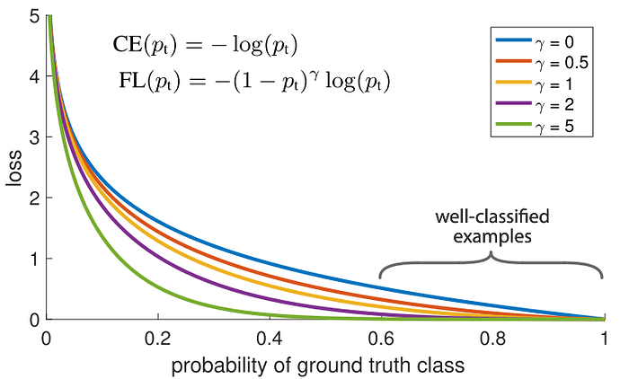
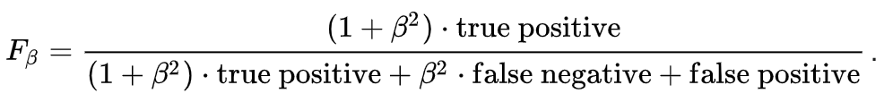

## Table of Content

- [Labeling](#Labeling)

- [Training](#Training)

- [Architecture](#Architecture)

- [Result](#Architecture)

- [How it works](#How-it-works)

### Labeling
Để label dữ liệu, chúng tôi sử dụng công cụ có tên là labelme. 

Công cụ này lưu file đã label dạng .json nhưng chúng ta cũng có thể sử dụng một thư viện nằm trong công cụ cho phép biến đổi các file .json thành file segment dạng ảnh (.jpg, .png).

### Training

Ý tưởng cốt lõi của chúng tôi: Từ một ảnh đầu vào có thể sử dụng deep learning/semantic segmentation để segment thành các object khác nhau như: **Line**, **Road**, **Background**, **Traffic Signs**. 

Package này sẽ nêu rõ các vấn đề tại sao chúng tôi lại sử dụng các mô hình và metrics. Việc sử dụng cho mục đích gì sẽ được nêu rõ ở một package khác trong ROS có tên là **fptu_architecture** nơi thực hiện các thuật toán lái xe và dự đoán góc lái.

### Architecture

Về kiến trúc, chúng tôi sử dụng kiến trục mạng PSPNet với backbone efficientnetb4 được train trên tập imagenet. Kích thước ảnh đầu vào là (144,144) với 4 classes: Line, Road, Traffic Signs, Background.

Về loss, chúng tôi kết hợp hai hàm loss: focal loss và weighted dice loss với trọng số của mỗi class được tính bằng tổng pixel của mỗi class chia cho tổng pixel của toàn bộ tập ảnh huấn luyện. 

Ngoài ra, chúng tôi có kết hợp một số hàm loss khác với nhau như jaccard loss + focal loss (hoặc weighted cross-entropy) kết quả huấn luyện không đạt hiệu quả bằng focal loss và weighted dice loss. 

Với các tham số cho dice loss, chúng tôi muốn chú trọng nhiều hơn true positive nên chúng tôi đã đặt hệ số beta = 0.5 bởi vì với sa hình thi đấu, việc segment thiếu road sẽ an toàn hơn việc segment thừa road. 

## Result

Kết quả đạt được: IoU 86%, F1-Score 90%. (Vẫn đang cải thiện)

## How it works

Chạy notebook goodgame_GPU.ipynb. Sẽ update source-code trong thời gian tới.