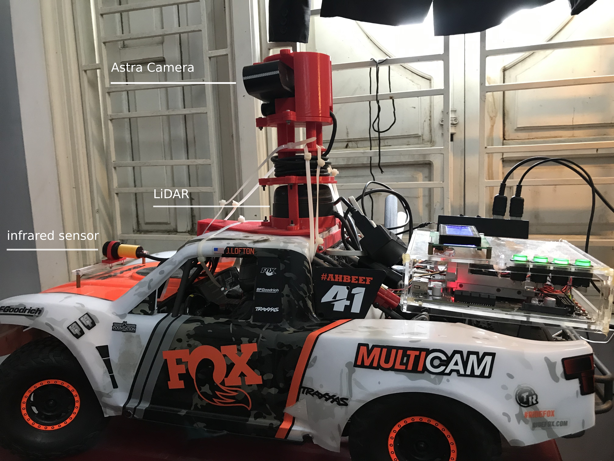

## Table of Content
- [Dira](#dira)
- [Libraries](#libraries)
- [Driverless System](#driverless-system)

## Dira

When the digital race organizers hand over the car to each team, they will install three basic packages to receive messages and launch that car.

1. [dira_mpu9250_controller](https://github.com/datvuthanh/Digital-Race/tree/master/src/dira_mpu9250_controller)
2. [dira_pca8266_controller](https://github.com/datvuthanh/Digital-Race/tree/master/src/dira_pca8266_controller)
3. [dira_peripheral_controller](https://github.com/datvuthanh/Digital-Race/tree/master/src/dira_peripheral_controller)

Hardware requirements:
1. Jetson TX2
2. LCD 16x4
3. Arduino Mini
4. Servo SG90
5. Orrbec Astra Camera
6. RPLidar A2
7. Infrared sensor

## Libraries

The minimum libraries must be installed on jetson tx2:

1. Orrbec Astra camera libraries on ROS (http://wiki.ros.org/astra_camera)
2. Rplidar_ros for LiDAR 2D - rplidar A2 (http://wiki.ros.org/rplidar)
3. Rtabmap and Navigation (http://wiki.ros.org/rtabmap_ros và http://wiki.ros.org/navigation)

Besides, to optimized jetson tx2's performance we installed other libraries:

1. Numba (https://github.com/jefflgaol/Install-Packages-Jetson-ARM-Family)
2. Tensorflow, Keras
3. Speed up TensorRT's model on jetson-tx2 (https://jkjung-avt.github.io/tf-trt-revisited)

## Driverless System