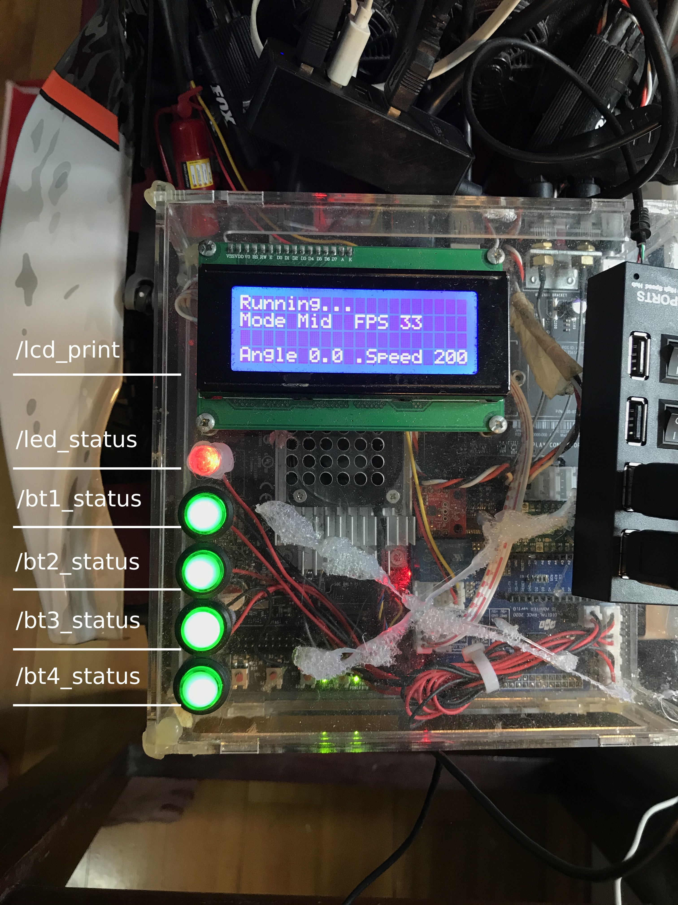

## Peripheral Controller
Use the Terminal to run the following command:
```
  roslaunch dira_peripheral_controller dira_peripheral_controller.launch
```

### Topics

<center>

</center>

#### Subscribers
---
##### LED
```
led_status (Bool)
True - LED turn on
False - LED turn off
```
##### Publishers
---
##### Buttons
```
bt1_status (Bool) - button 1 pressed or not
..
..
bt4_status (Bool) - button 4
```
##### Sensors
```
ss1_status (Bool) - proximity sensor slot 1
ss2_status (Bool) - proximity sensor slot 2
```
##### LCD 
```
lcd_print (string) - Display message on LCD
```